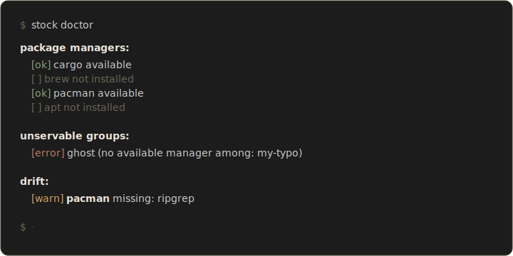

[](https://github.com/cushycush/stock/actions/workflows/test.yml)
[](https://github.com/cushycush/stock/releases)
[](https://aur.archlinux.org/packages/stock-bin)
[](https://pkg.go.dev/github.com/cushycush/stock)
[](LICENSE)

`stock` provisions the packages, tools, and runtimes declared in `.store/packages.yaml` — one YAML file, one command per machine. Listing `brew`, `apt`, and `pacman` side by side inside a group lets the same config serve your Arch desktop, Debian server, and macOS laptop without forks; `stock` runs whichever manager is actually installed.

Pair with [`store`](https://github.com/cushycush/store) for dotfile symlinks, or use it alone — you stock a store with inventory.

> **Status:** v0.3 shipping, unit-tested on the load-bearing paths (config parsing, runner dispatch, plan orchestration, install flow). The maintainer is the first real user; early adopters welcome.

## Install

**TL;DR** — on Arch, `yay -S stock-bin`. Anywhere else, `go install github.com/cushycush/stock/cmd/stock@latest`. Full matrix below.

### Arch Linux (AUR)

Three packages, pick one:

```sh
yay -S stock-bin     # prebuilt binary (recommended)
yay -S stock         # source build
yay -S stock-git     # tracks main; for contributors
```

### Nix (flake)

```sh
nix run github:cushycush/stock -- doctor       # run once
nix profile install github:cushycush/stock     # install into your profile
nix develop github:cushycush/stock             # dev shell with Go + gopls pinned
```

### Go

```sh
go install github.com/cushycush/stock/cmd/stock@latest
```

Requires Go 1.26+.

### Prebuilt binaries

Cross-compiled zips for linux / darwin / windows on amd64 and arm64 (except windows / arm64) attach to every tagged release on the [releases page](https://github.com/cushycush/stock/releases).

## Config

`stock` reads `.store/packages.yaml` at the repo root. Each top-level group maps a manager key (`brew`, `apt`, `pacman`, …) to a list of package names. An optional `when:` clause gates the group to specific platforms, hostnames, or shells.

```yaml
packages:
  core:
    pacman: [git, ripgrep, fd, bat]
    apt:    [git, ripgrep, fd-find, bat]
    brew:   [git, ripgrep, fd, bat]
    when:   { os: [linux, darwin] }

  gui-linux:
    pacman: [firefox, alacritty]
    apt:    [firefox-esr, alacritty]
    when:   { os: linux }

  work-laptop:
    brew: [tailscale, 1password-cli]
    when: { hostname: [work-mbp, work-mbp-2] }
```

Listing multiple managers inside one group is the intended pattern. `stock` runs whichever manager is available on the current machine; `stock doctor` only flags a group as unservable when **none** of its managers are installed. `apt`-on-Arch or `brew`-on-Linux are not warnings.

### `when:` fields

`os`, `arch`, `distro`, `distro_version`, `hostname`, `shell`, `wsl`. Each string field accepts a scalar (`os: linux`) or a list (`os: [linux, darwin]`). All specified fields must match; within a list, any entry matches. Semantics match [store-core](https://github.com/cushycush/store-core#when-matching).

## Commands

**Day-to-day**

- `stock install [group...]` — install everything matching platform + `when:`
- `stock diff [group...]` — preview what `install` would change (read-only)
- `stock doctor` — verify managers, detect drift from `packages.yaml`

**Maintenance**

- `stock snapshot` — write currently installed packages to `.store/packages.yaml`
- `stock platform` — print detected platform info

**New machine**

- `stock bootstrap` — run hooks, `install`, then `store` (if available)

**Flags**

- `--dry-run` — print commands that would run; don't execute. Works for `install` and `bootstrap`.
- `snapshot --write` writes to `.store/packages.yaml` instead of stdout. Add `--force` to overwrite an existing file. `--group <name>` chooses the group header (default `host`). `--managers brew,cargo` restricts which managers are snapshotted.
- `bootstrap --skip-store` — run hooks and `install`, but skip invoking the `store` binary afterwards.

Unknown commands fall back to `stock-<name>` on `$PATH` (git-style), so you can add your own subcommands without recompiling.

## Hooks

`stock` runs executables placed under `<root>/.store/hooks/` before and after install:

| Hook name | When it runs |
|---|---|
| `pre-install` | before `stock install` |
| `post-install` | after `stock install` |
| `pre-bootstrap` | at the start of `stock bootstrap` |
| `post-bootstrap` | at the end of `stock bootstrap` |

Hooks receive the standard [`STORE_*` env vars](https://github.com/cushycush/store-core#hook-env-contract) plus `STORE_ACTION=install` (or `bootstrap`), and run with `$STORE_ROOT` as the working directory.

## Supported managers

`brew`, `pacman`, `apt`, `dnf` (falls back to `yum`), `zypper`, `apk`, `winget`, `cargo`, `go`, `npm`, `pipx`, `gem`, `brew-cask`.

Contributions of new managers live in [`internal/managers/`](./internal/managers). Each file registers itself via `init()` and implements a short interface (`Name`, `Available`, `Installed`, `Install`, `BootstrapHint`).

## Non-goals (for now)

- **Uninstalling or pinning package versions.** `stock` is a declarative installer, not a full state reconciler. Use your package manager directly for removals or specific versions.
- **Shipping in nixpkgs upstream.** The flake self-installs; upstream packaging is a separate ask.

## Related

- [**`store`**](https://github.com/cushycush/store) — the symlink manager `stock` pairs with. If both are on `$PATH`, `store` delegates unknown subcommands to `stock` via git-style dispatch (`store stock doctor` ≡ `stock doctor`), and its TUI header shows a dim `stock` signpost so you know the companion is available.
- [**`store-core`**](https://github.com/cushycush/store-core) — the shared Go module both tools import for platform detection, `when:` matching, and the `STORE_*` hook env contract.

## License

MIT. See [LICENSE](LICENSE).
